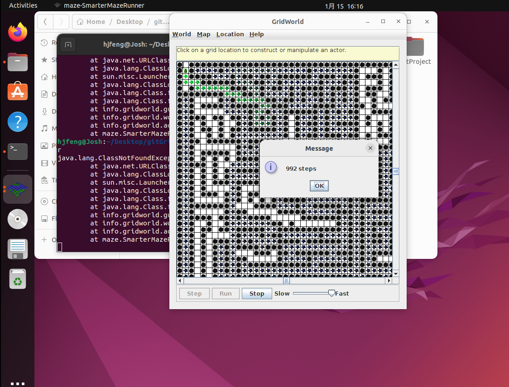

## 中山大学软件工程学院20级中级实训课程项目
##### 项目名称：GridWorld游戏开发
##### 学院：软件工程学院
##### 年级：20级
##### 指导老师：黄袁
##### 助教：林泽炜
##### 小组成员
| 姓名 | 学号 |
| ---- | ---- |
| 冯洪江 | 20331012 |
| 储震坤 | 20318068 |
| 黄能 | 20331014 |
| 宋皓 | 20331032 |
| 李昱航| 20331022 |
##### [项目成果仓库](https://github.com/Joshvon/GridWorld)
**该文档以markdown存于仓库**
下载项目
```shell
git@github.com:Joshvon/GridWorld.git
```
编译项目
```shell
ant
```
运行项目，比如运行一个代价偏好算法自动走迷宫
```shell
cd classes
java maze.SmarterMazeRunner
```
### 项目背景
该项目基于`Java.swing`和`Java.awt`等工具包构建的GridWorld一个图形化环境用于可视化对象在二维网格中的交互。在这个案例中，我们设计和制造各种Actor的对象，将它们添加到一个网格中，并且根据一定的规则决定Actor的行为。此外还完成了N-Puzzle（华容道）和MazeBug（迷宫）等拓展任务
### 完成情况
小组成员根据开发手册的内容进行同步开发，小组成员完成所有内容。项目运行环境为`Linux`，使用`jdk1.8`并且使用`Ant`进行编译
1. 在个人电脑上安装虚拟机程序并配置好`jdk`和`Ant`环境
2. 编写`ant`文件（项目仓库下的`mybuild.xml`文件）并运行第一个程序（`project/fistProject/BugRunner`）
3. Part1-Part5[开发记录](https://github.com/Joshvon/GridWorld/blob/main/exp.md)
4. 拓展任务
   + MazeBug
     使用了两种算法，一种是深度优先算法实现的
    ```java
     //info.gridworld.maze.MazeBug.java
     /**/
     //栈来保存可移动位置来实现深度搜索
     public Stack<ArrayList<Location>> crossLocation = new Stack<ArrayList<Location>>(); 
     //一个哈希集合来保存走过的位置
     protected Set<Location> hasVisited = new HashSet(); 
     /**/
     public boolean canMove() {
		Grid<Actor> gr = getGrid();
		if (gr == null)
			return false;
		Location loc = getLocation();
		ArrayList<Location> locs = getValid(loc);
		for(int i = locs.size() -1; i >= 0; i--) {  //移除走过的位置
			Location location = locs.get(i);
			if(hasVisited.contains(location)) locs.remove(i);
		}
		if(locs.size() > 0) {    //随机走一个位置并将其他可走位置压入栈中
			int index = (int) (Math.random()* locs.size());
			next = locs.get(index);   //保存下一步要走的位置
			locs.add(loc);
			crossLocation.push(locs);
		}
		else {   //没位置可走则沿途返回
			ArrayList<Location> l = crossLocation.pop();
			next = l.get(l.size() - 1);
		}
		return true;
	}
    ```
     一种是代价偏好算法实现的，新建一个类继承MazeBug
     ```java
     //info.gridworld.maze.SmarterMazeBug.java
     /**/
     //记录四个方向的前进的偏好
    private int[] factor = {0, 0, 0, 0};        
    /**/
     @Override
    public boolean canMove() {
        Grid<Actor> gr = getGrid();
		if (gr == null)
			return false;
		Location loc = getLocation();
		ArrayList<Location> locs = getValid(loc);
        for(int i = locs.size() -1; i >= 0; i--) {
			Location location = locs.get(i);
			if(hasVisited.contains(location)) locs.remove(i);
		}
        if(locs.size() > 0) {
			next = getNext(locs);
			locs.add(loc);
			crossLocation.push(locs);
		}
        else {  //当发现无路可走时要减少该方向的偏好
            ArrayList<Location> l = crossLocation.pop();
            next = l.get(l.size() - 1);
            if (next.getDirectionToward(getLocation()) == Location.SOUTH) {
                // north
                factor[1]--;
            }
            if (next.getDirectionToward(getLocation()) == Location.NORTH) {
                // south
                factor[0]--;
            }
            if (next.getDirectionToward(getLocation()) == Location.WEST) {
                // east
                factor[2]--;
            }
            if (next.getDirectionToward(getLocation()) == Location.EAST) {
                // west
                factor[3]--;
            }
        }
        return true;
    }
    //选取factor较大的方向前进并将其factor加1
    private Location getNext(ArrayList<Location> locs) {
        Location[] validloc = { null, null, null, null };
        for (int i = 0; i < locs.size(); i++) {
            if (locs.get(i).getDirectionToward(getLocation()) == Location.SOUTH) {
                // north
                validloc[0] = locs.get(i);
            }
            if (locs.get(i).getDirectionToward(getLocation()) == Location.NORTH) {
                // south
                validloc[1] = locs.get(i);
            }
            if (locs.get(i).getDirectionToward(getLocation()) == Location.WEST) {
                // east
                validloc[3] = locs.get(i);
            }
            if (locs.get(i).getDirectionToward(getLocation()) == Location.EAST) {
                // west
                validloc[2] = locs.get(i);
            }
        }
        int target = -1;
        for(int i = 0; i < validloc.length; i++) {
            if(validloc[i] != null) {
                if(target == -1) target = i;
                if(factor[i] > factor[target]) target = i;
            }
        }
        factor[target]++;
        return validloc[target];
    }
     ```
    + N-Puzzle
      使用两种算法，一种是广度优先搜索
      ```java
      /**/
      public boolean BFSearch(JigsawNode bNode, JigsawNode eNode) {
        Set<Integer> visited = new HashSet<>();
        Queue<JigsawNode> q = new LinkedList<>(); //用队列保存
        visited.add(bNode.hashCode());
        q.offer(bNode);

        while(!q.isEmpty()) {
            currentJNode = q.poll();
            int[] canMove = currentJNode.canMove();
            JigsawNode tmp = new JigsawNode(currentJNode);
            for(int i = 0; i < 4; i++) {
                currentJNode = new JigsawNode(tmp);
                if(canMove[i] == 1) {
                    //移动数码
                    currentJNode.move(i);
                    //因为N-Puzzle问题每一个情况都是唯一的也是有唯一的哈希值         
                    int hash = currentJNode.hashCode();
                    //这种情况探索过 
                    if(visited.contains(hash)) continue;    
                    else visited.add(hash);
                    if(currentJNode.equals(eNode)) {
                        getPath();
                        System.out.println(getSolutionPath());
                        return true;
                    }
                    q.offer(currentJNode);
                }
            }
        }
        return false;
      }
      ```
    一种是A*算法
    ```java
    public final boolean ASearch(JigsawNode bNode, JigsawNode eNode) {

        this.visitedList = new HashSet<>(1000);
        this.exploreList = new PriorityQueue<>(500, new Comparator<JigsawNode>() {
            @Override
            public int compare(JigsawNode a, JigsawNode b) {
                if (a.getEstimatedValue() < b.getEstimatedValue()) {
                    return -1;
                } else if (a.getEstimatedValue() > b.getEstimatedValue()) {
                    return 1;
                } else if (a.getNodeDepth() < b.getNodeDepth()) {
                    return -1;
                } else if (a.getNodeDepth() > b.getNodeDepth()) {
                    return 1;
                }
                return 0;
            }
        });

        this.beginJNode = new JigsawNode(bNode);
        this.endJNode = new JigsawNode(eNode);
        this.currentJNode = null;

        // 访问节点数大于29000个则认为搜索失败
        final int MAX_NODE_NUM = 29000;
        final int DIRS = 4;

        // 重置求解标记
        this.searchedNodesNum = 0;
        this.solutionPath = null;

        //将起始节点放入exploreList中
        this.visitedList.add(this.beginJNode);
        this.exploreList.add(this.beginJNode);

        //如果exploreList为空，或者访问节点数大于MAX_NODE_NUM个，则搜索失败，问题无解;否则循环直到求解成功
        while (this.searchedNodesNum < MAX_NODE_NUM && !this.exploreList.isEmpty()) {
            this.searchedNodesNum++;

            //取出exploreList的第一个节点N，置为当前节点currentJNode
            //若currentJNode为目标节点，则搜索成功，计算解路径，退出
            this.currentJNode = this.exploreList.poll();
            if (this.currentJNode.equals(eNode)) {
                this.getPath();
                break;
            }

            // 记录并显示搜索过程
            JigsawNode[] nextNodes = new JigsawNode[]{
                new JigsawNode(this.currentJNode), new JigsawNode(this.currentJNode),
                new JigsawNode(this.currentJNode), new JigsawNode(this.currentJNode)
            };

            //寻找所有与currentJNode邻接且未曾被发现的节点，将它们按代价估值从小到大排序插入exploreList中
            //并加入visitedList中，表示已发现
            for (int i = 0; i < DIRS; i++) {
                if (nextNodes[i].move(i) && !this.visitedList.contains(nextNodes[i])) {
                    JigsawNode tempJNode = new JigsawNode(nextNodes[i]);
                    this.estimateValue(tempJNode);
                    nextNodes[i].setEstimatedValue(tempJNode.getEstimatedValue());
                    this.visitedList.add(nextNodes[i]);
                    this.exploreList.add(nextNodes[i]);
                }
            }
        }

        System.out.println("Jigsaw AStar Search Result:");
        System.out.println("Begin state:" + this.getBeginJNode().toString());
        System.out.println("End state:" + this.getEndJNode().toString());
        // System.out.println("Solution Path: ");
        // System.out.println(this.getSolutionPath());
        System.out.println("Total number of searched nodes:" + this.getSearchedNodesNum());
        System.out.println("Depth of the current node is:" + this.getCurrentJNode().getNodeDepth());
        return this.isCompleted();
    }
    ```
### 项目结构
`/framework` 项目主要框架，包括网格，游戏角色，gui等，**MazeBug**也在其中
`/N-Puzzle` N-Puzzle（华容道）代码
`/projects` 开发主要代码，包括各种`Actor`对象和对应的`Runner`运行类
`/resources` `MazeBug`迷宫游戏运行所需地图

### 部分代码及运行截图
`/project/Jumper/Jumper.java`
```java
package Jumper;

import info.gridworld.actor.Bug;
import info.gridworld.grid.Location;
import info.gridworld.grid.Grid;
import info.gridworld.actor.Actor;
import info.gridworld.actor.Flower;

public class Jumper extends Bug
{
    public boolean canJump() {
        Grid<Actor> gr = getGrid();
        if (gr == null)
            return false;
        Location loc = getLocation();
        Location next = loc.getAdjacentLocation(getDirection());
        if(!gr.isValid(next))
            return false;
        Location next_next = next.getAdjacentLocation(getDirection());
        if (!gr.isValid(next_next))
            return false;
        Actor neighbor2 = gr.get(next_next);
        return (neighbor2 == null) || (neighbor2 instanceof Flower);
    }
    public void jump()
    {
        Grid<Actor> gr = getGrid();
        if (gr == null)
            return;
        Location loc = getLocation();
        Location next = loc.getAdjacentLocation(getDirection());
        Location next_next = next.getAdjacentLocation(getDirection());
        if (gr.isValid(next_next))
            moveTo(next_next);
        else
            removeSelfFromGrid();
        Flower flower = new Flower(getColor());
        flower.putSelfInGrid(gr, loc);
    }
    public void act() {
        if(canJump())
            jump();
        else
            turn();
    }
}
```

`/framework/info/gridworld/maze/SmarterMazeBug.java`
```java
package info.gridworld.maze;

import info.gridworld.grid.*;
import info.gridworld.actor.Actor;

import java.awt.Color;
import java.util.ArrayList;

public class SmarterMazeBug extends MazeBug{

    private int[] factor = {0, 0, 0, 0};

    public SmarterMazeBug() {
        setColor(Color.GREEN);
		last = new Location(0, 0);
    }

    @Override
    public boolean canMove() {
        Grid<Actor> gr = getGrid();
		if (gr == null)
			return false;
		Location loc = getLocation();
		ArrayList<Location> locs = getValid(loc);
        for(int i = locs.size() -1; i >= 0; i--) {
			Location location = locs.get(i);
			if(hasVisited.contains(location)) locs.remove(i);
		}
        if(locs.size() > 0) {
			next = getNext(locs);
			locs.add(loc);
			crossLocation.push(locs);
		}
        else {
            ArrayList<Location> l = crossLocation.pop();
            next = l.get(l.size() - 1);
            if (next.getDirectionToward(getLocation()) == Location.SOUTH) {
                // north
                factor[1]--;
            }
            if (next.getDirectionToward(getLocation()) == Location.NORTH) {
                // south
                factor[0]--;
            }
            if (next.getDirectionToward(getLocation()) == Location.WEST) {
                // east
                factor[2]--;
            }
            if (next.getDirectionToward(getLocation()) == Location.EAST) {
                // west
                factor[3]--;
            }
        }
        return true;
    }

    private Location getNext(ArrayList<Location> locs) {
        Location[] validloc = { null, null, null, null };
        for (int i = 0; i < locs.size(); i++) {
            if (locs.get(i).getDirectionToward(getLocation()) == Location.SOUTH) {
                // north
                validloc[0] = locs.get(i);
            }
            if (locs.get(i).getDirectionToward(getLocation()) == Location.NORTH) {
                // south
                validloc[1] = locs.get(i);
            }
            if (locs.get(i).getDirectionToward(getLocation()) == Location.WEST) {
                // east
                validloc[3] = locs.get(i);
            }
            if (locs.get(i).getDirectionToward(getLocation()) == Location.EAST) {
                // west
                validloc[2] = locs.get(i);
            }
        }
        int target = -1;
        for(int i = 0; i < validloc.length; i++) {
            if(validloc[i] != null) {
                if(target == -1) target = i;
                if(factor[i] > factor[target]) target = i;
            }
        }
        factor[target]++;
        return validloc[target];
    }
}
```

`迷宫游戏运行截图`
